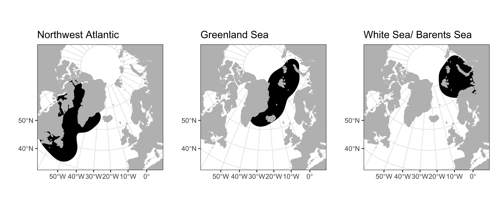

<!-- README.md is generated from README.Rmd. Please edit that file -->

[](https://www.repostatus.org/#active)

```{r setup, include=FALSE}
knitr::opts_chunk$set(echo = TRUE)
```

### Background

This folder contains candidate environmental covariates that could be included in the population models.

These data have been extracted by Pearse Buchanan (University of Liverpool) and collated and uploaded to GitHub by James Grecian (University of St Andrews).

There are two types of data:  

### 1. Global climate indices

The **global climate indices** included are:

* North Atlantic Oscillation<sup>1</sup>
* Atlantic Multidecadal Oscillation<sup>2</sup>
* Subpolar Gyre Index<sup>3</sup>

These files are simply two or three columns containing year, month and the value of the indices.

1. https://www.ncdc.noaa.gov/teleconnections/nao/
2. https://psl.noaa.gov/data/timeseries/AMO/
3. Generated from the second EOF of ssh produced by the ECMWF ORAS5 global reanalysis hindcast simulation  
https://icdc.cen.uni-hamburg.de/en/daten/reanalysis-ocean/easy-init-ocean/ecmwf-oras5.html  
Zuo, H., Balmaseda, M. A., Tietsche, S., Mogensen, K., and Mayer, M.: The ECMWF operational ensemble reanalysis–analysis system for ocean and sea ice: a description of the system and assessment, Ocean Sci., 15, 779–808, https://doi.org/10.5194/os-15-779-2019, 2019.

#### Reading in the data

You can load the files as follows:

```{r example, warning = F, message = F}
require(tidyverse)
require(lubridate)

NAO <- read_csv("NAO.csv")
NAO <- NAO %>% mutate(DATE = make_date(YEAR, MONTH))

AMO <- read_csv("AMO.csv")
AMO <- AMO %>% mutate(DATE = make_date(YEAR, MONTH))

SGI <- read_csv("SGI.csv")

```

#### Plotting the data

You can plot the data as follows:

```{r plots, warning = F, message = F}
require(patchwork)

p1 <- ggplot() + geom_point(aes(x = DATE, y = VALUE), data = NAO) + ylab("NAO")
p2 <- ggplot() + geom_point(aes(x = DATE, y = VALUE), data = AMO) + ylab("AMO")
p3 <- ggplot() + geom_point(aes(x = YEAR, y = VALUE), data = SGI) + ylab("SGI")

p1 / p2 / p3
```

### 2. Regional environmental covariates

The **regional enviornmental covariates** included are:

* Sea Surface Temperature (mean and standard deviation)
* Sea Surface Temperature anomaly relative to the 30 year climatological mean from 1971-2000 (mean and standard deviation)
* Sea ice (maximum annual extent, day of maximum extent, minimum annual extent, day of minimum extent)

The SST and ice metrics come from the NOAA’s Optimal Interpolation SST v2.1, which provides daily values of SST, SST anomaly, and areal sea ice concentration from 1982-present. The average SST is the full spatio-temporal mean each year within the given population regions. The standard deviations reflect temporal variability, and do not reflect spatial variability.

Huang, B., C. Liu, V. Banzon, E. Freeman, G. Graham, W. Hankins, T. Smith, and H.-M. Zhang, 2020: Improvements of the Daily Optimum Sea Surface Temperature (DOISST) - Version 2.1, https://doi.org/10.1175/JTECH-D-19-0177.1

The regions are defined as the areas used by the three harp seal breeding populations based on our ongoing analysis of harp seal telemetry data:
 


#### Reading in the data

You can load the files as follows:

```{r pop example, warning = F, message = F}
pop_covs <- read_csv("population covariates.csv")
head(pop_covs)
```

#### Plotting the data

You can plot the data as follows:

```{r pop plots, warning = F, message = F}
p4 <- ggplot() +
  geom_point(aes(x = year, y = SST_anomaly_mean), data = pop_covs) +
  ylab("SST Anomaly (mean)") +
  facet_wrap(~population, nrow = 3)
p5 <- ggplot() + 
  geom_point(aes(x = year, y = ice_extent_max), data = pop_covs) +
  ylab("Max Sea Ice Extent (million km2)") +
  facet_wrap(~population, nrow = 3)

p4 + p5

```

