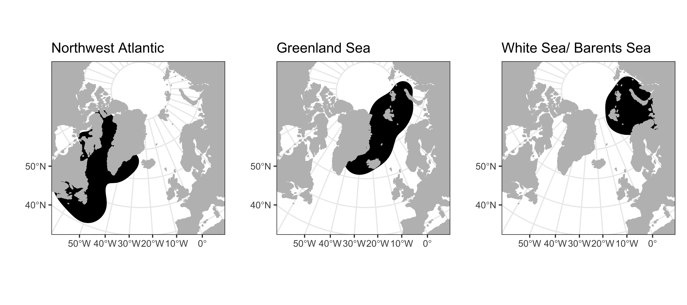

Environmental covariate datasets
================

<!-- README.md is generated from README.Rmd. Please edit that file -->

[](https://www.repostatus.org/#active)

### Background

This folder contains candidate environmental covariates that could be
included in the population models.

These data have been extracted by Pearse Buchanan (University of
Liverpool) and collated and uploaded to GitHub by James Grecian
(University of St Andrews).

There are two types of data:

### 1\. Global climate indices

The **global climate indices** included are:

  - North Atlantic Oscillation<sup>1</sup>
  - Atlantic Multidecadal Oscillation<sup>2</sup>
  - Subpolar Gyre Index<sup>3</sup>

These files are simply two or three columns containing year, month and
the value of the indices.

1.  <https://www.ncdc.noaa.gov/teleconnections/nao/>
2.  <https://psl.noaa.gov/data/timeseries/AMO/>
3.  Generated from the second EOF of ssh produced by the ECMWF ORAS5
    global reanalysis hindcast
    simulation  
    <https://icdc.cen.uni-hamburg.de/en/daten/reanalysis-ocean/easy-init-ocean/ecmwf-oras5.html>  
    Zuo, H., Balmaseda, M. A., Tietsche, S., Mogensen, K., and Mayer,
    M.: The ECMWF operational ensemble reanalysis–analysis system for
    ocean and sea ice: a description of the system and assessment, Ocean
    Sci., 15, 779–808, <https://doi.org/10.5194/os-15-779-2019>, 2019.

#### Reading in the data

You can load the files as follows:

``` r
require(tidyverse)
require(lubridate)

NAO <- read_csv("NAO.csv")
NAO <- NAO %>% mutate(DATE = make_date(YEAR, MONTH))

AMO <- read_csv("AMO.csv")
AMO <- AMO %>% mutate(DATE = make_date(YEAR, MONTH))

SGI <- read_csv("SGI.csv")
```

#### Plotting the data

You can plot the data as follows:

``` r
require(patchwork)

p1 <- ggplot() + geom_point(aes(x = DATE, y = VALUE), data = NAO) + ylab("NAO")
p2 <- ggplot() + geom_point(aes(x = DATE, y = VALUE), data = AMO) + ylab("AMO")
p3 <- ggplot() + geom_point(aes(x = YEAR, y = VALUE), data = SGI) + ylab("SGI")

p1 / p2 / p3
```

<!-- -->

### 2\. Regional environmental covariates

The **regional enviornmental covariates** included are:

  - Sea Surface Temperature (mean and standard deviation)
  - Sea Surface Temperature anomaly relative to the 30 year
    climatological mean from 1971-2000 (mean and standard deviation)
  - Sea ice (maximum annual extent, day of maximum extent, minimum
    annual extent, day of minimum extent)

The SST and ice metrics come from the NOAA’s Optimal Interpolation SST
v2.1, which provides daily values of SST, SST anomaly, and areal sea ice
concentration from 1982-present. The average SST is the full
spatio-temporal mean each year within the given population regions. The
standard deviations reflect temporal variability, and do not reflect
spatial variability.

Huang, B., C. Liu, V. Banzon, E. Freeman, G. Graham, W. Hankins, T.
Smith, and H.-M. Zhang, 2020: Improvements of the Daily Optimum Sea
Surface Temperature (DOISST) - Version 2.1,
<https://doi.org/10.1175/JTECH-D-19-0177.1>

The regions are defined as the areas used by the three harp seal
breeding populations based on our ongoing analysis of harp seal
telemetry data:



#### Reading in the data

You can load the files as follows:

``` r
pop_covs <- read_csv("population covariates.csv")
head(pop_covs)
```

    ## # A tibble: 6 x 10
    ##   population  year SST_mean SST_std SST_anomaly_mean SST_anomaly_std
    ##   <chr>      <dbl>    <dbl>   <dbl>            <dbl>           <dbl>
    ## 1 northwest…  1982     3.79    2.51           -0.501           0.297
    ## 2 northwest…  1983     3.96    2.46           -0.335           0.236
    ## 3 northwest…  1984     3.82    2.68           -0.466           0.334
    ## 4 northwest…  1985     3.96    2.74           -0.332           0.259
    ## 5 northwest…  1986     3.95    2.58           -0.341           0.328
    ## 6 northwest…  1987     4.12    2.63           -0.172           0.158
    ## # … with 4 more variables: ice_extent_min <dbl>, ice_min_doy <dbl>,
    ## #   ice_extent_max <dbl>, ice_max_doy <dbl>

#### Plotting the data

You can plot the data as follows:

``` r
p4 <- ggplot() +
  geom_point(aes(x = year, y = SST_anomaly_mean), data = pop_covs) +
  ylab("SST Anomaly (mean)") +
  facet_wrap(~population, nrow = 3)
p5 <- ggplot() + 
  geom_point(aes(x = year, y = ice_extent_max), data = pop_covs) +
  ylab("Max Sea Ice Extent (million km2)") +
  facet_wrap(~population, nrow = 3)

p4 + p5
```

<!-- -->
