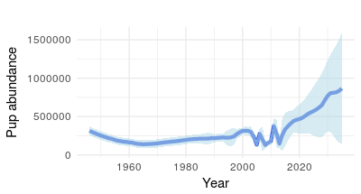
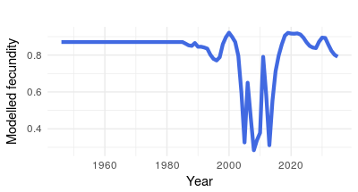

```{r setup, include=FALSE}
knitr::opts_chunk$set(echo = TRUE)
```
# State-space model
In Øigård and Skaug (2014) a new statistical model for modelling the harp seal pupulation was developed and compared with the curred deterministic model. In this section the original method is reviewed and extensions of the original model are discussed.

### Original state-space method

In the original state-space model developed in Øigård and Skaug (2014), fecundity was modelled as a stochastic-process. For an initial period $y\in[y_0,y_s]$ fecundity $F_y$ is assumed to be constant (due to lack of observations), $F_y = f_{init}$. Starting in year $y_s$ a 1st order auto-regressive (AR) process $x_y = a_1x_{y−1} + u_y$ is used as a
perturbation around $f_{init}$. Here, $a_1$ is the auto-regressive parameter and $u_y$ is a zero mean normally distributed “innovation term” with standard deviation $\sigma$. Since we require $0\leq F_y\leq 1$ we employ the logistic transformation
$$F_y=\frac{\exp (\xi +x_y)}{1+\exp (\xi + x_y)},$$
where $\xi = \log \{f_{init}/(1-f_{init})\}$.

### Extended state-space model to include prey availability

We extend the original state-space model to include availability of capelin and cod. Capelin and cod have proved to have a significant effect on the condition of the harp seals. Capelin has a positive relationship, the more capelin, the better the condition of the harp seals. Cod, however, has a negative relationship with condition of the harp seals as it preys on capelin and therefore acts as a competitor for harp seals. We propose to replace the AR(1) process in the original state-space model with the following mixed model $x_y = a_1x_{y−1} + a_2capelin + a_3cod + u_y$ as a
perturbation around $f_{init}$. Here, $a_1$ is the auto-regressive parameter, $a_2$ is the fixed effect of capelin, $a_3$ is the fixed effect of cod, and $u_y$ is a zero mean normally distributed “innovation term” with standard deviation $\sigma$.

Data on total biomass ($TB$) are taken from ICES stock assessments: *http://standardgraphs.ices.dk/stockList.aspx*. We use capelin total biomass in the Barents Sea/Norwegian Sea as an index of prey availability, and total biomass of East Arctic cod as an index of competition. While cod data go back to 1946, capelin data are (so far) only available from 1972 onwards. However, an estimate of capelin biomass, reconstructed based on stomach contents of cod (Marshall et al. 2000), is available for the period 1946-1972. These data (except the 1972 data), have also been included. In modelling the total biomass of capelin and cod has been normalized.

### Results
A first look comparison between the original state-space model and the extended model which includes capelin and cod data.

{ width=20%}




Tried to remove the AR(1) part from the mixed model but by doing that it was not possible for the optimization routine to converge.

## Sophies proposal

For the fecundity of the seals, let's sort out some definitions. 

'pregnancy rate' means the proportion of seals found to be pregnant that year when they are lethally sampled, based usually on ovaries from moulting animals. Symbol $\phi$ (this is a proportion or probability so no units)

'natality' means the probability of producing a live pup. Symbol $\nu$ (this is a proportion or probability so no units) 

The number of females pregnant in year $t$ given there are $n_t$ females in the population could look like this


$$n_{pregnant,t,age}\sim Binomial(n_t,\phi_{t,age})$$
$$n_{pregnant,t}=\sum_{ages} {n_{pregnant,t,age}}$$
Where the pregnancy rate is a response to environmental variables which I represent as a vector of different ones $\vec{x}$ e.g. capelin, SST etc. Parameters in this function are in vector $\vec{\theta}$

$$\phi_{t,age} = f(\vec{\theta},\vec{x}) ogive(age)$$
A very common type of formulation is to make $f(\vec{\theta},\vec{x})$ into a logistic equation which might go like this

$$f(\vec{\theta},\vec{x})=\frac{exp(\beta_0+\beta_{capelin}CapelinBiomass+\beta_{cod}CodBiomass)}{1+exp(\beta_0+\beta_{capelin}CapelinBiomass+\beta_{cod}CodBiomass))}$$


Note that I've also included a multiplier on the logistic function $ogive(age)$ to take account that fecundity changes with age. 

This approach could be used to estimate $\vec{\theta}$ i.e. the $\beta$ values, based on observations of $\phi_t$ , capelin and cod. 

Then some of those females go on to actually pup. The proportion that do is $Q$ and we could allow this to vary by year as well, but let's not for now!

$$n_{pups}\sim Binomial(n_{pregnant,t},Q)$$

This can all be embedded in the seal population model which updates the female population at every time step.

### Comments to Sophie

Sophie, I have some troubles linking your proposal to the current model. I have tried to review the most important equations in the current model below. The syntax does not agree with your terms but I hope we will be able to understand each other. In the population dynamics model we have the following iterating equations.

$$N_{1,y} = (N_{0,y-1}-C_{0,y-1})s_0,\quad\quad (1)$$
$$N_{a,y} = (N_{a-1,y-1}-C_{a-1,y-1})s_{1+},\quad a = 2,\ldots,A-1,\quad\quad (2)$$
$$N_{A,y} = [(N_{A-1,y-1}-C_{A-1,y-1})+(N_{A,y-1}-C_{A,y-1})]s_{1+}$$.

Here $C_{a,y}$ is the catch of age group $a$ in year $y$, $s_0$ is the pup mortality, and $s_{1+}$ is the 1+ mortality.

The modelled pup abundance for a given year $y$ is then given by
$$N_{0,y} = \frac{F_y}{2}\sum_{a=1}^Ap_{a,y}N_{a,y},\quad\quad (3)$$

so we need to identify quantities in your idea to make it fit into the current framework. If I understand correct your $n_{pregnant,t}$ is the number of pregnant females in year $t$. This is for is for all age groups? Or is it? In our framework $N_{a,y}/2$ is the number of females in in each age group. So in our case would the number of females in year $t$ or $y$ be $F_y\sum N_{a,y}/2$? (The number of females for an age group $a$ in year $y$ is $N_{a,y}/2$). Hence, the total number of females (pregnant + not pregnant) for all age groups is $\sum_a N_{a,y}/2$. It is assumed that half of the population is females). I'm struggling a bit to see how to incorporate your equations in the model. Maybe we have to rethink the model formulation then? Maybe it is as easy as saying that in your
$$n_{pregnant,t,age}\sim Binomial(n_t,\phi_{t,age})$$

we say that your $n_t$ (the number of females in the population in year $t$) is our $\sum_a N_{a,y}$? But from your equations we need to know the number of pups for a given year $t$ or $y$, i.e., we need to know $N_{0,y}$. In your equations you have the following 
$$n_{pups}\sim Binomial(n_{pregnant,t},Q)$$
but does that give the total number of pups for all years, which is not really interesting, or should it say $n_{pups,t}$, which would be our $N_{0,y}$*? If that is the case and what I describe above is correct then I believe we have linked the equations so that they work together. 

```
* Comment from Martin: This seems correct to me, and I believe it’s what Sophie meant. She was under quite a bit of time pressure as she scribbled down these equations, right Sophie?
```

Next, we would need to identify $F_y$, as I'm sure it would be usefull, and also required that we are able to show what values of fecundity are used each year. In your equations you have that
$$\phi_{t,age} = f(\vec{\theta},\vec{x}) ogive(age).$$

First I wonder if it should be $f_t(\vec{\theta},\vec{x})$? Could you then say that your $f_t(\vec{\theta},\vec{x})$ and the $F_y$ are the same and that
$$
F_y = f_t(\vec{\theta},\vec{x}) = \phi_{t,age} / ogive(age)?
$$

In your text you mention the natality rate $\nu$ but I cannot see where it is used. Am I missing something?**

```
** Comment from Martin: This is where I think it becomes very important to distinguish between what we actually estimate as fecundity Φt and natality $\nu_t$. 

When we (very infrequently) estimate $\phi_t$, we use samples collected from hunting during moult in year $t-1$, only a few months after the previous breeding. This is what Sophie calls $n_{pregnant,t}$. 

Natality $\nu_t$  is the number of females we actually expect to give birth, after seals have spent the summer, autumn and winter foraging. This is the parameter we expect to most closely match with observed pup production in year $t$. 

My feeling is that the environmental covariates for prey and competition should influence the conversion from $\phi_t$ to $\nu_t$. When conditions are good (high prey abundance and/or low competition), the difference between $\phi_t$ and $\nu_t$ should be small, whereas in years with poor conditions (low prey abundance and/or high competition), the difference is greater. So we’re perhaps talking about estimating a bias term, which is influenced by environmental covariates?     
```
We should try to sum this up and use the same notation and write down the equations so that Sophies equations fits into the model framework, or rewrite the model framework to make it fit Sophies equations.


Then when we understand this it's just implementing it.... Remember in TMB you cannot simulate, the model formulation you describe looks like you have simulation in your mind, or maybe not :-).
