---
output:
  pdf_document: default
  html_document: default
---


---
title: "How to use the `rSPAMM` package"
author: "T. A. Øigård and M. Biuw"
date: "`r Sys.Date()`" 
output: 
  rmarkdown::pdf:
    toc: true
    number_sections: true
---

```{r, include = FALSE}
knitr::opts_chunk$set(
  collapse = TRUE,
  comment = "#>",
  fig.width = 7,
  fig.height = 5
)
```

```{r setup, include=FALSE}
library(rSPAMM)
```
# Overview
In this pdf you will find instructions on how to use the `rSPAMM` package for assessment of various harp and hooded seal populations. It will guide you through the model fitting, obtaining estimated quantities, finding and exploring, various catch options, how to structure the data set, and how to visualize the modelled population dynamics. In the appendix we provide a script for a complete analysis of the demo data, and we present the population dynamics model used.


To load the `rSPAMM` package type
```{r eval = TRUE}
library(rSPAMM)
```

# Data used by the population dynamics model and how to load them

The population dynamics model use historical catch records, fecundity rates, age specific proportions of mature females, and estimates of pup production to estimate the population size trajectory. Two types of reproductive data are used in the model: information on the proportion of females that are mature at a given age (i.e., maturity ogive) and the proportion of mature females that are pregnant at a given year (i.e. fecundity rate). In this section we will describe what type of data is used, which data files are needed, and the format the various data are stored.


## Demo data
When cloning the repository both a demo data set is installed. In addition a full data set is available in the *wk_WKSEALS-2020/data/Norway/* folder. 

The demo data is reproductive data, catch data, pup production estimates and priors used for population dynamics modelling of the harp seal population in the East Ice (White Sea).

To load the demo data:
```{r eval = TRUE}
data("harpeastDemo")
```

The demo data is a list called `harpeast` containing two lists called `data` and `parameters`. The `data` list contains the data needed to fit the population dynamics model and the `parameters` list contains the parameters estimated by the model along with initial values of them.

```{r eval = TRUE}
names(harpeast$data)

names(harpeast$parameters)
```

To use the demo data set in the following examples it would be easiest to split the list in two separate lists `data` and `parameters`, i.e.,

```{r eval = TRUE}
data = harpeast$data
parameters = harpeast$parameters
```


## Loading the full data set
The full data set is stored in the repositorys data folder (in the Norway folder).

It does not matter what is set to working directory, but when loading these data to use with the *rSPAMM* you might want to adjust the *dataPath* variable defined below. In this example it is assumed that the working directory is set to the *rSPAMM* model folder, i.e., that the working directory is the root folder of the *rSPAMM* package.

In order to load the data you have to specify which population you want to load the data for. The various alternatives are `harpeast`, `harpwest`, and `hooded` (which is the hooded seal population in the West Ice - the ice along the east coast of Greenland). In the examples that follows we will use the `harpeast` population. 

To load the data used you run the following function:
```{r eval=FALSE}
dataPath = "../../../../data/Norway/"
population = "harpeast"
dataFiles = paste0(dataPath,population)
data <- load.data(population = dataFiles)
```

```{r echo=FALSE}
data = harpeast$data
parameters = harpeast$parameters
```

To explore the data object you can
```{r}
names(data)
```

The data object is a list and you can further explore the actual values used by e.g.,
```{r}
data$Amax

data$pupProductionData

```

# Parameters to be estimed and how to load them
As briefly mentioned earlier the population dynamics model is described by three parameters. The initial population size $K$, the mortality of the 1+ population $M$, and the pup mortality $M_0$. The initial population size is the population size for the year the model is fit from, and this is determined by the availability of the catch data. The earliest catch data is from 1946, so the model is fit from 1946 and up to present. It also predicts the population dynamics into the future, and this is default set to 15 years. 

To load the initial values of the parameters to be estimated run:
```{r eval=FALSE}
parameters <- load.initial.values(population = "harpeast")
```
The parameters object is also a list and the content looks like this for the `harpeast` population
```{r}
parameters
```
Here `logK` is the log transformed initial population size, `M0tilde` is the logit transformed pup mortality, and `Mtilde` is the logit transformed 1+ mortality (seals of age 1 and greater). The reason that transformed parameters are estimated instead of the non transformed parameters is that the log transformation of the initial population ensures that the model provides a stricktly positive estimate of the initial population. The logit tranformation of the mortalities ensures that the estimates are bounded between 0 and 1. 

# Model fitting and obtaining estimates
The model is implemented in the Template Model Builder framework and makes use of the `TMB` R package. This means that the code for model is written in C++ and will be compiled when you install the `rSPAMM` package. When installing the `rSPAMM` package the `TMB` package and all dependencies should also be installed automatically.

## Fitting the population dynamics model
The optimization routine used is `nlminb`. 
To fit the model run:

```{r}
optobj <- run.model(data = data, par = parameters)
```

When the model is fitted some key information will be written to screen. This key information show whether the model converged, what type of convergence and estimates of the parameters that describes the modelled population dynamics.

The `run.model` function returns a list containing the model object `obj` and the final optimized opject `opt`.

## Obtaining the estimated quantities
In addition to the estimated parameters needed to describe the modelled population dynamics of a population the model fit also provides the user with other relevant quantities. The Table below lists the various quantities obtained.

----------------------------------------------------
Variable name           Description
-----------------       ----------------------------
rep                     Check it out

rep.matrix              Check

rep.names               check

indN0                   Indexes of where the fitted pup population is found in the
                        rep.matrix
                     
indN1                   Indexes for the modelled 1+ population

indNtot                 Indexes for  the total population

indD1                   Index for the estimated of D 

indD1new                Index for the estimated D1new

indN0Current            Index for the modelled pup abundance in the current year

indN1Current            Index for the modelled 1+ abundance in the current year

indNtotCurrent          Index for the modelled total population in the current year                     

years                   The years the model is fitted for

Kest                    Estimated initial population size

Kest.sd                 Standard deviation of the initial population size

Mest                    Estimated 1+ mortality

Mest.sd                 Standard deviation of the 1+ mortality

M0est                   Estimated pup mortality

M0est.sd                Standard deviation of the estimated pup mortality

D1                      Estimated depletion coefficient

DNmax                   Estimated of depletion coefficient using Nmax and Npred

N0Current               Estimated pup abundance for the current year

N1Current               Estimated 1+ abundance for the current year

NTotCurrent             Estimated total abundance for the current year

D1.sd                   Standard deviation of estimated D

DNmax.sd                Standard deviation of estimated D using Nmax and Npred

N0Current               Standard deviation of current pup abundance

N1Current               Standard deviation of current 1+ abundanceI

NTotCurrent             Standard deviation of current total abundance
-------------------------------------------------

The model results can be obtained by running:
```{r}
res <- model.results(data = data,optobject = optobj)
```
The `res` object is a list containing all the estimates of the quantities listed in the Table above.

```{r}
names(res)
```

A table for the most interesting quantities needed can be made by running:
```{r}
partab <- par.table(results=res, dat=data) 

partab 
```

# Visualize the modelled population dynamics
In this section we will show how to create graphics to present the various output of the modelling results. To display the modelled pup abundance and the total abundance you run the following function:
```{r}
plotRes(res,data)
```

***

**In order to open an OS independent graphical devise use the option `grDev = TRUE`, i.e,**
```{r eval = FALSE}
plotRes(res,data,grDev = TRUE)
```

***


<!-- { width=98%} -->

If you want to turn off the mean trajectory for the predictions and only plot the 95 percent konfidence intervals for the projections you add the option `plotProjMean = FALSE`, i.e.,
```{r}
plotRes(res,data,plotProjMean = FALSE)
```

If you want to show the pup trajectory and the 1+ group you change the `compnent` option, i.e.,
```{r}
plotRes(res,data,component = c("N0","N1"))
```

You can also plot the fit to the pup abundance, the 1+ group, or the total abundance separately by specifying that in the `component` option:
```{r}
plotRes(res,data,component = c("N0"))
```

***
<!-- 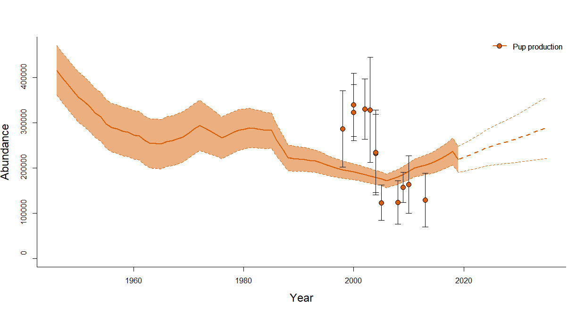{ width=98%} -->

```{r}
plotRes(res,data,component = c("Ntot"))
```

***
<!-- 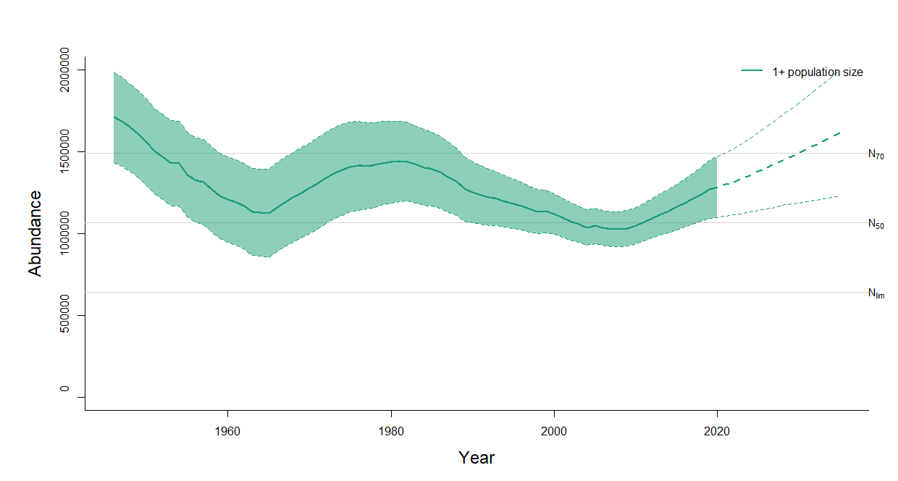{ width=98%} -->

You can also choose to not plot the future projections by setting `plotProjections = FALSE` . 
```{r}
plotRes(res,data,plotProjections = FALSE)
```

***
<!-- 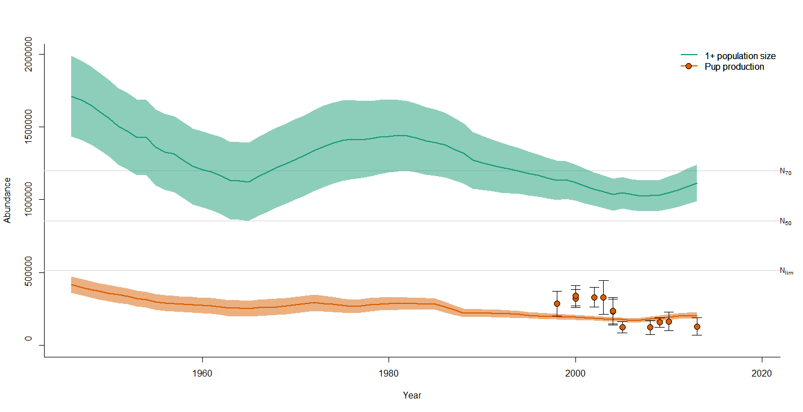{ width=98%} -->

The horizontal lines for $N_{lim}$, $N_{50}$ and $N_{70}$ can be turned off by setting `plotNlims = FALSE`. For other options you can run `?plotRes`.

If you want to visualize certain types of data you can plot the historical catch level used, the fecundity vector and the birth ogive curves for each time period. To plot the catch data run the `plotCatch()` function:
```{r eval = FALSE}
plotCatch(catch = data$Cdata)
```
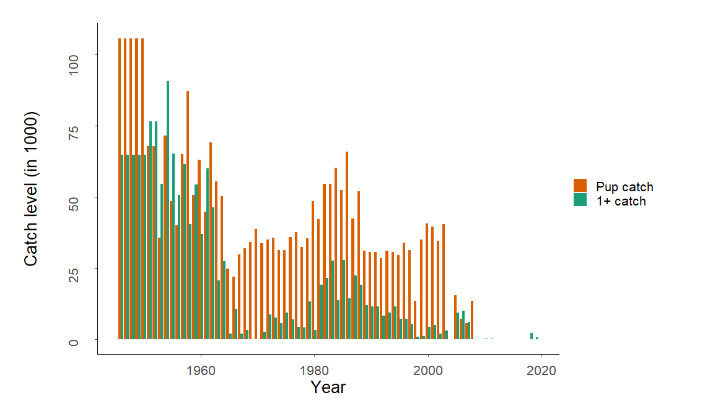{ width=98%}


***

Default the bars are next to each other, but the bars can be plotted on top of each other by setting `position = "stack"`:
```{r eval = FALSE}
plotCatch(catch = data$Cdata,position = "stack")
```

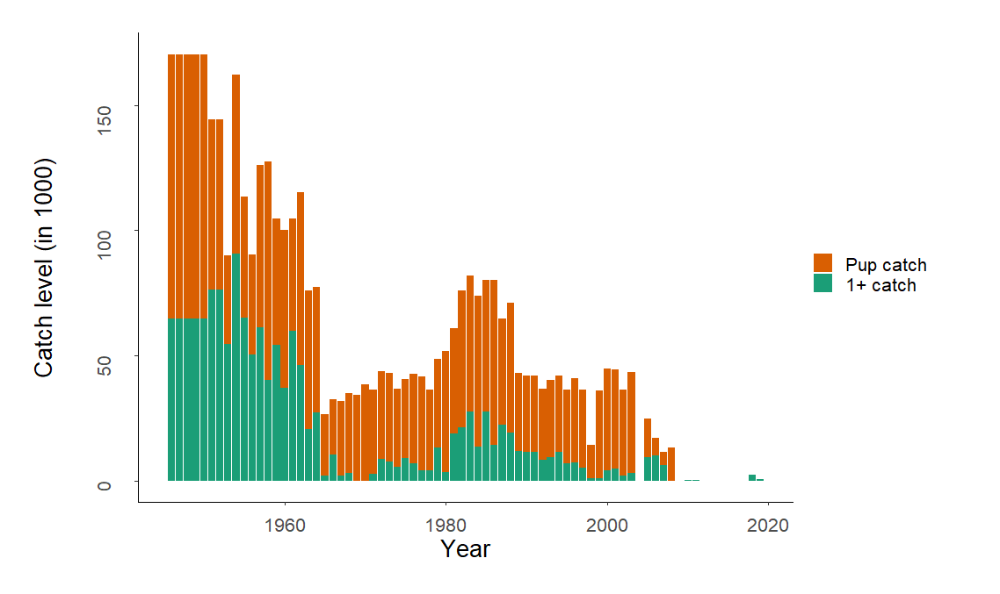{ width=98%}

***

You can plot the modelled population dynamics (pup abundance and total abundance, not the 1+ population) and the reported catch in the same figure using `plotResCatch()`

```{r eval = FALSE}
plotResCatch(res,data)
```
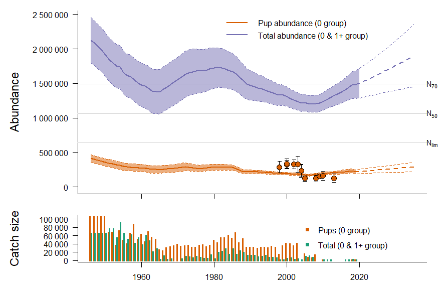{ width=98%}

***

If you want to explore the birth ogive data used for various periods you can run the `plotOgive()` function:
```{r fig.height=4}
plotOgive(dat = data)
```

***

<!-- 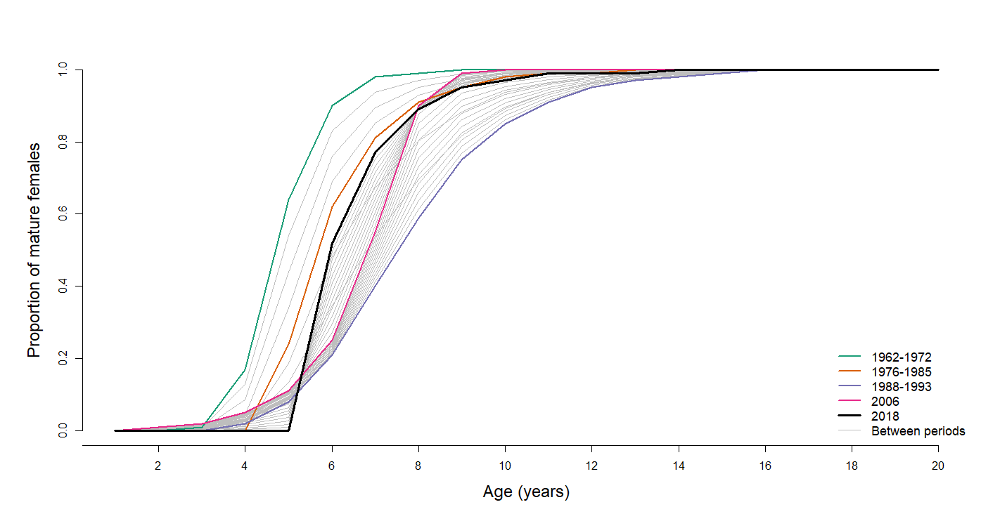{ width=98%} -->

Since fecundity rates is not available for all years they are interpolated between missing years. You can plot the fecundity rates used in the modelling by running `plotFecundity()`. Default it plots both the linear interpolated fecundity rates and the observed fecundity ratesfor a given population.
```{r fig.height=4}
plotFecundity(dat = data)
```

***

<!-- 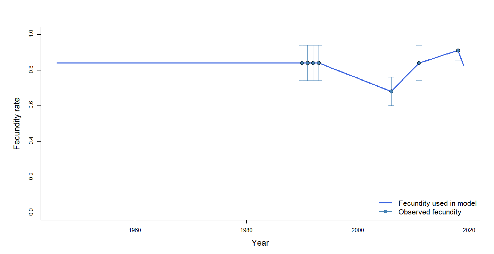{ width=98%} -->


# Exploring various catch options
In this section we will describe how to explore various catch options such as finding the equilibrium catch level, i.e., the fixed annual catch level that keeps the future projected population abundance constant, finding the catch level that would reduce the population to $N_{70}$ (70% of the current population size) with probability 0.8 over a 15-years period, and Potential Biological Removals (PBR) catch level.

## Equilibrium catch level
To find the equilibrium catch level we run the function `find.eq.quota()`.

Default is that the function assumes that zero pups are in the catch and that all catch are 1 year old animals or more. To change he proportion of pups and 1+ animals in the catch you use the `quota` variable, i.e., the following finds the equilibrium catch level assuming 15% pups and 85% 1+ animals in the catch:
```{r}
EquilibriumCatch <- find.eq.quota(data = data,
                                  parameters = parameters, 
                                  quota = c(0.15,0.85))

EquilibriumCatch
```

You have now found the fixed annual catch level that stabilizes the future 1+ population under the estimated model for the `harpeast` population and can re-run the model using this equilibrium catch level for the future projection. Default in the when running the model fit assumes zero catch for the future predictions. To re-run the model and plot the estimated future trajectory using the equilibrium catch level you run the following code:
```{r}
#Rerun the model
data$CQuota = EquilibriumCatch
optEq = run.model(data = data, par = parameters)
resEq = model.results(data = data,optobject = optEq)

#Plot model
plotRes(resEq,data)
```

***

## $N_{70}$ catch level
To find the the catch level that would reduce the population to 70% of the historical maximum observed (modelled) with probability 0.8 over a 15-year period you run the function `find.N70.quota()`:
```{r}
catchN70 = find.N70.quota(data = data,
                          parameters = parameters, 
                          quota = c(0,1))
```

For this population it turns out that the current population
size is below $N_{70}$. Because of this there is no point estimating the $N_{70}$ catch level.

This example assume that zero pups are in the catch and that all catch are 1 year old animals or more. To change he proportion of pups and 1+ animals in the catch you use the `quota` variable, i.e., use `quota = c(0.15,0.85)` to find the $N{70}$ catch level assuming 15% pups and 85% 1+ animals in the catch:

If the $N_{70}$ population size was below the current population size you could re-run the model using the estimated $N_{70}$ catch level 
```{r eval=FALSE}
data$CQuota = catchN70
optN70 = run.model(data = data, par = parameters)
resN70 = model.results(data = data,optobject = optN70)

#Plot the estimated future trajectory using the N70 catch level
plotRes(resN70,data)
```

## The Potential Biological Removals (PBR) catch level
Potential Biological Removals has been defined as:
$$PBR=\frac{1}{2}R_{max}F_rN_{min},$$
where $R_{max}$ is the maximum rate of increase for the population (default to 0.12 for pinnipeds), $F_r$ is the recovery factor with values between 0.1 and 1 (default to 0.5), and $N_{min}$ is the estimated population size using 20% percentile of the log-normal distribution. The PBR catch level assumes that the age structure of the removals is proportional to the age composition of the population (i.e. 14% ). To find the PBR catch level using the default parameters you run:
```{r}
pbrCatch = PBR(n0=partab[4,3], 
               n1=partab[5,3], 
               se0=partab[4,4], 
               se1=partab[5,4])

pbrCatch
```


where n0 is the current population size, n1 is the current 1+ population size, se0 is the standard deviation of the estimated current pup abundance, and se1 is the standard deviation of the estimated current 1+ abundance. Recall from the Table above that these quantities could be found using the `par.tab()` function.

Re-run the model using this catch level
```{r}
data$Quota = c(pbrCatch$n0catch,pbrCatch$n1catch)
optPBR = run.model(data = data, par = parameters)
resPBR = model.results(data = data,optobject = optPBR)

#Plot the estimated future trajectory using PBR catch level
plotRes(resPBR,data)
```

***

<!-- { width=98%} 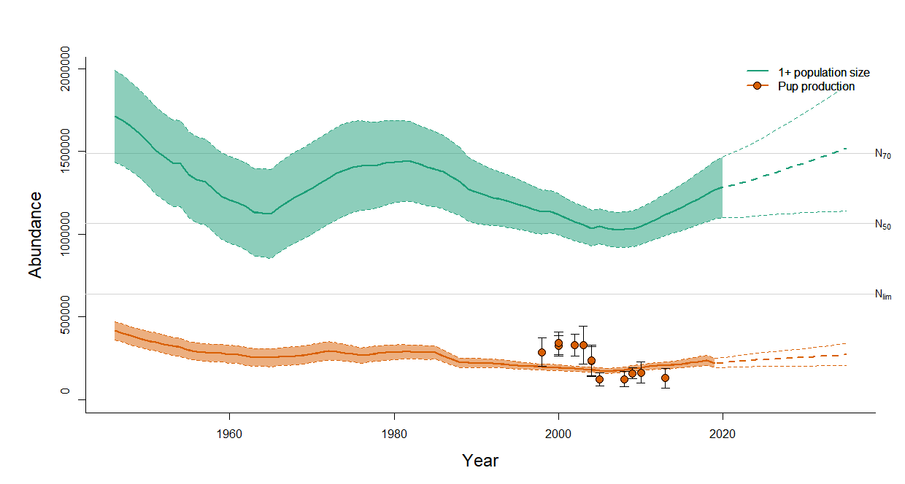{ width=98%}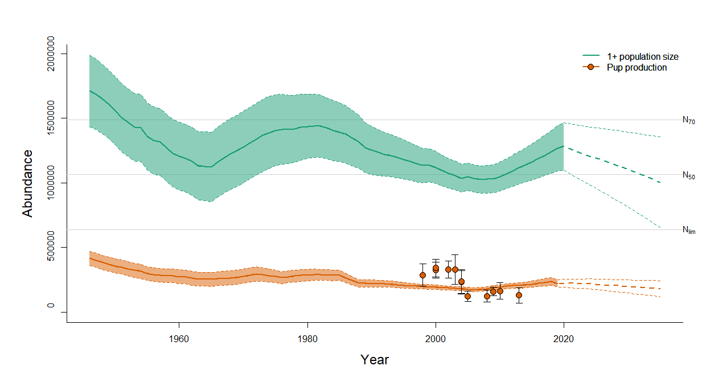{ width=98%} -->

<!-- 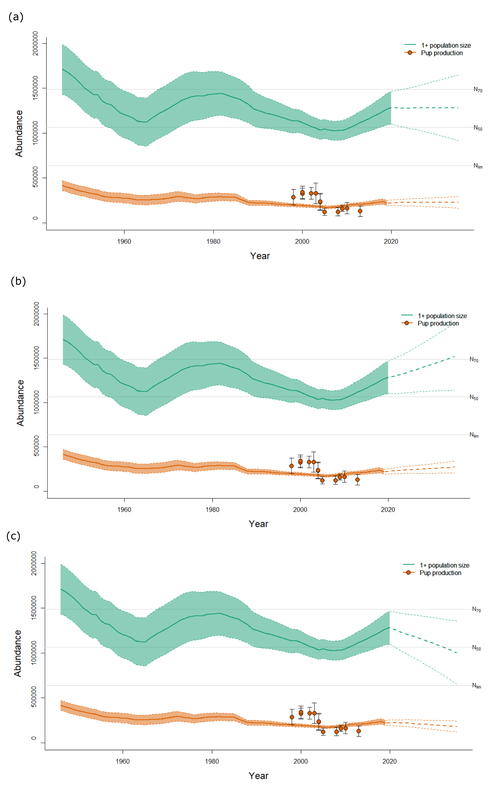{ width=98%} -->

# Appendix

## Complete code for assessment
This section contains a script for a complete analysis of the harp seal population in the East Ice (in the White Sea) using the `rSPAMM` package.
```{r eval = FALSE}
#Load the rSPAMM package
library(rSPAMM)

###################
# Data
###################
# You can choose to use either the demo data which is 
# included in the rSPAMM package or loading the full data

#Use this if analysing the demo data.
#Loading demo data and parameters
data("harpeastDemo")
data = harpeast$data
parameters = harpeast$parameters


#Use this if analysing latest version of the
#complete data set
#Download full data. Default the function will
#ask to create a new folder. If you already have 
#a folder you can add the option 
#"chooseFolder = FALSE".
#Note the Working Directory has to be set to the
#root folder of the downloaded data, i.e., not 
#the Data or the Scripts folder.
downloadData()
#Loading the data
data = load.data(population = "harpeast")
#Loading the parameters
parameters = load.initial.values(population = "harpeast")


##################
# Model fitting
##################
#Run the model
optobj = run.model(data = data, par = parameters)

#Obtain the results
res = model.results(data = data,optobject = optobj)

#Create a nice table with the results
partab = par.table(results=res, dat=data) 

#Plot the results (both the pup model fit and the N1+ population)
plotRes(res,data,grDev = TRUE)


##################
# Catch options
##################

#Find the equilibrium catch level
#In this example we are assuming 15% pups 
#and 85% 1+ animals in the catch
EquilibriumCatch = find.eq.quota(data = data,
                                 parameters =parameters,
                                 quota = c(0.15,0.85))

#Rerun the model using the estimated equilibrium catch level
data$CQuota = EquilibriumCatch
optEq = run.model(data = data, par = parameters)
resEq = model.results(data = data,optobject = optEq)

#Plot the estimated future trajectory using equilibrium catch level
plotRes(resEq,data,grDev = TRUE)

#--------------------------

#Find the N70 catch level
catchN70 = find.N70.quota(data = data,
                          parameters = parameters, 
                          quota = c(0,1))

#For this population it turns out that the current population
#size is below N70. Because of this there is no point estimating
#the N70 catch level.

#If the current population size was above N70 you could
#rerun the model using the estimated N70 catch level
data$CQuota = catchN70
optN70 = run.model(data = data, par = parameters)
resN70 = model.results(data = data,optobject = optN70)

#Plot the estimated future trajectory using the N70 catch level
plotRes(resN70,data,grDev = TRUE)

#--------------------------

#Find the PBR catch level
#In this example we are assuming 14% pups 
#and 86% 1+ animals in the catch
pbrCatch = PBR(n0=partab[4,3], 
               n1=partab[5,3], 
               se0=partab[4,4], 
               se1=partab[5,4])

#Re-run the model using the PBR catch level
data$CQuota = c(pbrCatch$n0catch,pbrCatch$n1catch)
optPBR = run.model(data = data, par = parameters)
resPBR = model.results(data = data,optobject = optPBR)

#Plot the estimated future trajectory using PBR catch level
plotRes(resPBR,data,grDev = TRUE)
```

## The population dynamics model
The population model is an age-structured population dynamics model. For initiation of the model it is assumed that the population had a stable age structure in year $y_0 = 1945$, i.e.,
$$
N_{i,y_0} = N_{y_0}s_{1+}^{i-1}(1-s_{1+}), \quad i = 1,\ldots,A-1,
$$
$$
N_{A,y_0}=N_{y_0}s_{1+}^{A-1}.
$$
Here $A$ is the maximum age group containing seals aged $A$ and higher, and set to 20 years, and $N_{y_0}$ is the estimated initial population size in year $y_0$. The model is parameterized by the natural mortalities $M_0$ and $M_{1+}$ for the pups and seals of 1 year and older, respectively. These mortalities determine the survival probabilities $s_0 = \exp(-M_0)$ and $s_{1+} = \exp(-M_{1+})$.

The model has the following set of recursion equations:
$$
N_{a,y}=\left(N_{0,y-1}-C_{0,y-1}\right)s_0,
$$
$$
N_{a,y}=\left(N_{a-1,y-1}-C_{a-1,y-1}\right)s_{1+},\quad a=2,\ldots,A-1,
$$
$$
N_{A,y}=\left[\left(N_{A-1,y-1}-C_{a-1,y-1}\right)+\left(N_{A,y-1}-C_{A,y-1}\right)\right]s_{1+}.
$$
Since available data do not allow for more detailed age-dependence in survival to be estimated it is assumed that the mortality rates are age-independent within the 1+ group. The $C_{a,y}$ are the age-specific catch numbers. Catch records are aggregated over age, and only provide information about the annual number of pups and number of 1+ seals caught. To obtain $C_{a,y}$ we assume that the age-distribution in the catch follows the modelled age distribution and employ *pro rata* rules in the model:
$$
C_{a,y} = C_{1+,y}\frac{N_{a,y}}{N_{1+,y}},\quad a = 1,\ldots,A.
$$

where $N_{1+,y} = \sum_{y=1}^A N_{a,y}$, with $N_{a,y}$ being the number of individuals ate age $a$ in year $y$.


The modelled pup abundance is given by
$$
N_{0,y}=\frac{F_y}{2}\sum_{a=1}^Ap_{a,y}N_{a.y},
$$

where $N_{a,y}/2$ is the number of females ate age $a$ in year $y$, $F_y$ is the time-varying fecundity rates and $p_{a,y}$ are the time-varying age specific proportions of mature females.

The model is fitted to the survey pup production estimates and the fecundity rates by maximum likelihood. Assuming normality for the pup production estimates, their contribution to the log-likelihood function is
$$
\sum_y-\log(\sigma_{0,y})-\frac{1}{2}\frac{\left(N_{0,y}-n_{0,y}\right)^2}{\left(\sigma_{0,y}\right)^2},
$$
where $n_{0,y}$ and $\sigma_{0,y}$ denote the survey pup production count and corresponding standard error for year $y$. 

The model has a Bayesian flavour as priors are imposed on some of the parameters. A vague normal prior is assumed for the initial population size $N_{y_0}$. A truncated normal prior was used for both the pup mortalities $M_0$ and $M_{1+}$.

All parameter estimates are found by maximizing the likelihood function using the R package `TMB`.
